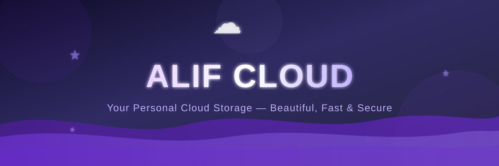

<div align="center">



<br/>

<a href="https://alifcloud.vercel.app">
  
</a>

<br/><br/>


<br/><br/>


<br/><br/>

> **💜 Your own private Google Drive — but you own everything, forever.**

</div>

<br/>

<!-- ════════════════════════════════════════════════════ -->


<br/>

&nbsp;&nbsp;&nbsp;[✨ Features](#-features) &nbsp;•&nbsp;
[🏗️ Tech Stack](#️-tech-stack) &nbsp;•&nbsp;
[📁 Project Structure](#-project-structure) &nbsp;•&nbsp;
[⚡ Quick Start](#-quick-start) &nbsp;•&nbsp;
[🌐 Deploy](#-deploy-to-vercel) &nbsp;•&nbsp;
[🛡️ Private Mode](#️-lock-down-for-personal-use) &nbsp;•&nbsp;
[📄 License](#-license)

<br/>

<!-- ════════════════════════════════════════════════════ -->


<br/>

<div align="center">

| &nbsp;Icon&nbsp; | Feature | Description |
|:---:|:---|:---|
| 📁 | **File Manager** | Upload, rename, delete & preview files with ease |
| 🖼️ | **Multi-format Support** | PDFs, images, videos, documents — all in one place |
| ⭐ | **Starred Files** | Bookmark your most important files for quick access |
| 🗑️ | **Trash System** | 30-day auto-delete with safe one-click restore |
| 🔗 | **Shareable Links** | Generate expiring public share links instantly |
| 📊 | **Analytics Dashboard** | Visual charts showing your storage usage over time |
| 🔒 | **Secure Auth** | Email login + Google OAuth via Supabase |
| 🌙 | **Dark Mode** | Sleek dark-first design — easy on the eyes |
| 📱 | **Fully Responsive** | Seamless experience on desktop, tablet & mobile |
| 🛡️ | **Private Mode** | Lock signups after setup — only you can access it |

</div>

<br/>

<!-- ════════════════════════════════════════════════════ -->


<br/>

<div align="center">


<br/>


<br/>


</div>

<br/>

<!-- ════════════════════════════════════════════════════ -->


<br/>

```
☁️ alif-cloud/
│
├── 📂 src/
│   ├── 📂 app/
│   │   ├── 🔐 (auth)/
│   │   │   ├── login/page.tsx          ← Login page
│   │   │   └── signup/page.tsx         ← Signup page
│   │   │
│   │   ├── 📊 (dashboard)/
│   │   │   ├── files/page.tsx          ← Main file manager
│   │   │   ├── starred/page.tsx        ← Starred files
│   │   │   ├── trash/page.tsx          ← Recycle bin
│   │   │   ├── shared/page.tsx         ← Share links manager
│   │   │   ├── analytics/page.tsx      ← Storage usage charts
│   │   │   └── settings/page.tsx       ← User settings
│   │   │
│   │   ├── 🔗 share/[token]/page.tsx   ← Public share page
│   │   ├── ⬇️ api/download/route.ts    ← Secure download API
│   │   └── layout.tsx
│   │
│   ├── 🧩 components/
│   │   ├── layout/Sidebar.tsx
│   │   ├── layout/TopBar.tsx
│   │   └── files/FilesClient.tsx
│   │
│   └── 📚 lib/
│       ├── supabase/client.ts
│       ├── supabase/server.ts
│       ├── utils/index.ts
│       └── types/index.ts
│
├── 🗄️ supabase-schema.sql              ← Database schema
├── ⚙️ .env.example
├── ⚙️ next.config.mjs
└── 📦 package.json
```

<br/>

<!-- ════════════════════════════════════════════════════ -->


<br/>

> **Prerequisites:** Node.js `18+` &nbsp;|&nbsp; A free [Supabase](https://supabase.com) account

<br/>

**`Step 1`** — Clone the repository

```bash
git clone https://github.com/alif6280/alif-cloud.git
cd alif-cloud
```

**`Step 2`** — Set up Supabase

```
1. Go to supabase.com → New Project
2. SQL Editor → paste supabase-schema.sql → Run
3. Authentication → Providers → Enable Google (optional)
4. Project Settings → API → Copy your credentials
```

**`Step 3`** — Configure environment variables

```bash
cp .env.example .env.local
```

```env
NEXT_PUBLIC_SUPABASE_URL=https://your-project.supabase.co
NEXT_PUBLIC_SUPABASE_ANON_KEY=your-anon-public-key
```

**`Step 4`** — Install & run

```bash
npm install
npm run dev
```

<div align="center">

🎉 Open **[http://localhost:3000](http://localhost:3000)** — your cloud is ready!

</div>

<br/>

<!-- ════════════════════════════════════════════════════ -->


<br/>

```
1.  Push this project to GitHub
2.  Go to vercel.com → "Add New Project"
3.  Import your repository
4.  Add environment variables:
       NEXT_PUBLIC_SUPABASE_URL
       NEXT_PUBLIC_SUPABASE_ANON_KEY
5.  Hit Deploy! 🚀
```

<div align="center">

[](https://vercel.com/new/clone?repository-url=https://github.com/alif6280/alif-cloud)

</div>

<br/>

<!-- ════════════════════════════════════════════════════ -->


<br/>

Once you've created your account, prevent anyone else from signing up:

```
Supabase Dashboard
  → Authentication
  → Settings
  → Disable "Enable Sign Ups"
```

<div align="center">

> 🔐 **Now only you can log in. Your cloud. Your rules.**

</div>

<br/>

<!-- ════════════════════════════════════════════════════ -->


<br/>

```bash
npm run dev       # 🔥 Start development server  →  localhost:3000
npm run build     # 📦 Build for production
npm run start     # 🚀 Start production server
npm run lint      # 🔍 Run ESLint checks
```

<br/>

<!-- ════════════════════════════════════════════════════ -->


<br/>

This project is licensed under the **MIT License** — free to use, modify, and distribute.

See the [LICENSE](./LICENSE) file for details.

<br/>

<!-- ════════════════════════════════════════════════════ -->

<div align="center">


<br/>

**Built with 💜 by [alif6280](https://github.com/alif6280)**

<br/>


&nbsp;

&nbsp;


<br/><br/>

☁️ **Alif Cloud** — *Your files. Your server. Your rules.*

<br/>

⭐ **If you find this useful, please consider giving it a star!** ⭐

</div>
